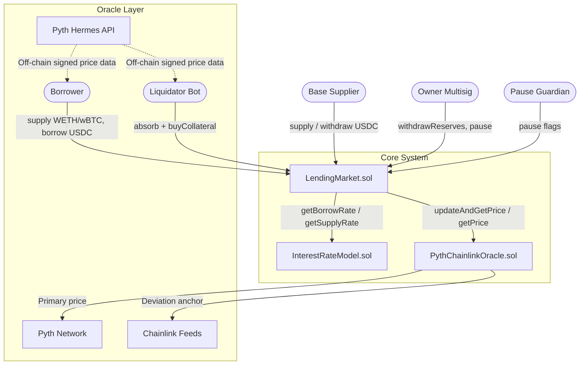
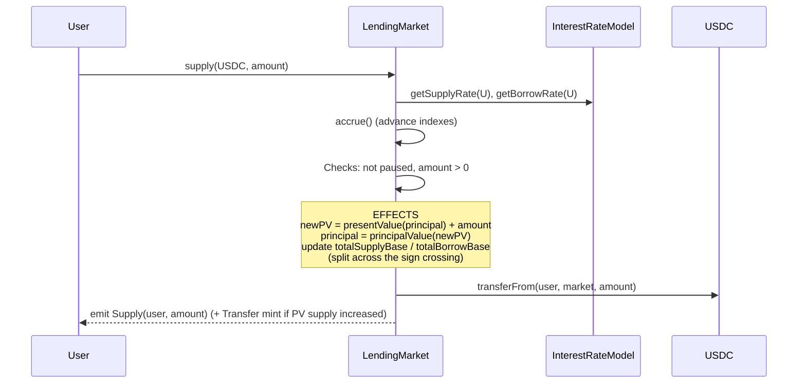
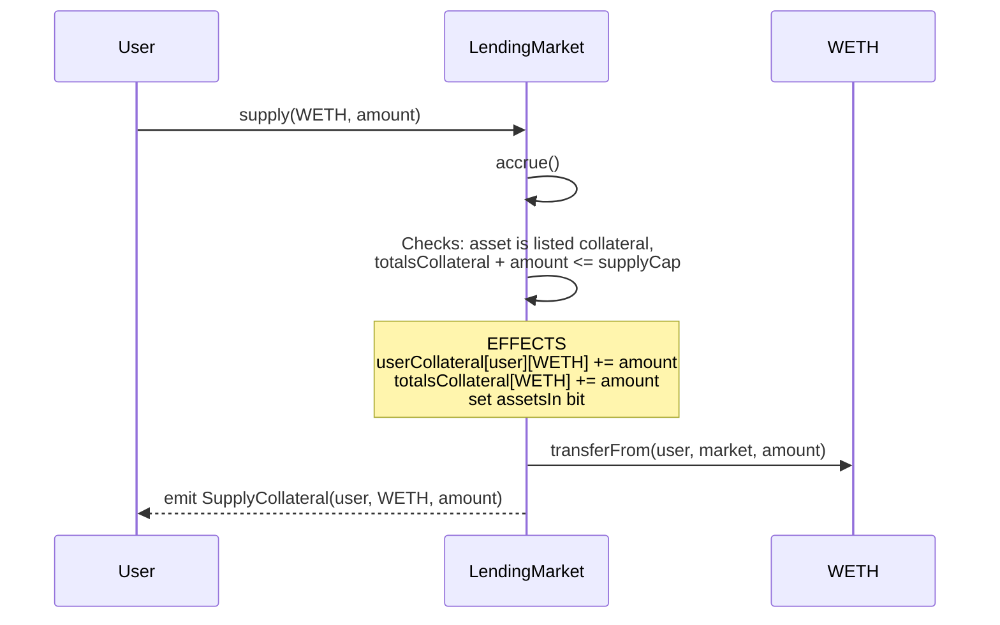
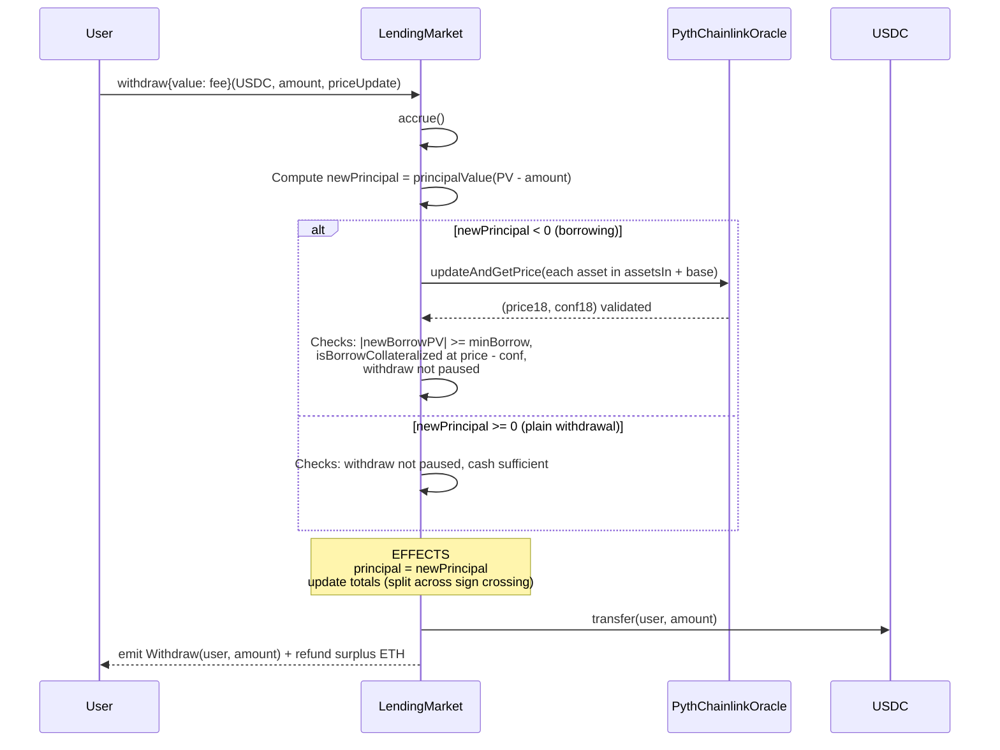
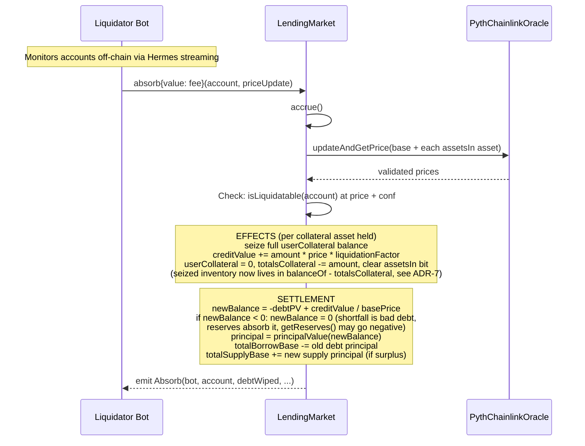
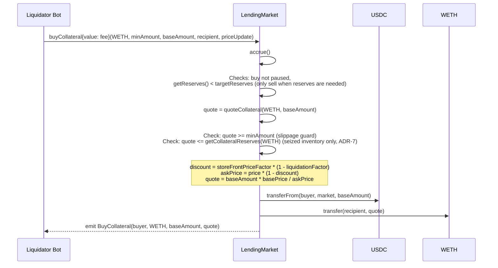

# 🏗️ Guide 3: Technical Architecture and Data Flow

**Version:** 1.0
**Prerequisites:** [Guide 2: Protocol Mathematics](./02-mathematics.md)
**Next:** [Guide 4: Trade-offs and Risk Matrix](./04-tradeoffs.md)

---

## 📋 Table of Contents

1. [Component Diagram](#1-component-diagram)
2. [Contract Set](#2-contract-set)
3. [State Layout](#3-state-layout)
4. [Interest Rate Model](#4-interest-rate-model)
5. [Oracle System (Pyth + Chainlink)](#5-oracle-system-pyth--chainlink)
6. [Detailed Execution Flows](#6-detailed-execution-flows)
7. [Design Patterns](#7-design-patterns)
8. [Architecture Decision Records](#8-architecture-decision-records)

---

## 1. Component Diagram

The protocol is a single-market money market in the style of Compound III (Comet): one borrowable base asset (USDC) and isolated, supply-only collateral assets (WETH, wBTC). All state and business logic live in one singleton, `LendingMarket.sol`. The interest rate curve and the price oracle are separate contracts behind minimal interfaces.

### High-Level View



### Detailed View (ASCII)

```
┌──────────────────────────────────────────────────────────────────────┐
│                             USER LAYER                               │
│      (Suppliers, Borrowers, Liquidator Bots, Frontend, Keepers)      │
│                                                                      │
│  For price-dependent actions the frontend or bot fetches signed      │
│  price data from Pyth Hermes and attaches it as calldata (pull       │
│  oracle model). Price-consuming functions are payable.               │
└───────────────┬──────────────────────────────────────────────────────┘
                │
                ▼
┌──────────────────────────────────────────────────────────────────────┐
│                         EVM CONTRACT LAYER                           │
│                                                                      │
│  ┌────────────────────────────────────────────────────────────┐      │
│  │                  LENDING MARKET (singleton)                │      │
│  │                                                            │      │
│  │  Base accounting (signed principal, rebasing ERC20)        │      │
│  │  • supply / withdraw (base and collateral)                 │      │
│  │  • borrow = withdraw(base) past zero                       │      │
│  │  • repay  = supply(base) while negative                    │      │
│  │  • accrue (advance supply/borrow indexes)                  │      │
│  │  • absorb (protocol-absorbed liquidation)                  │      │
│  │  • buyCollateral (discounted collateral sale)              │      │
│  │  • reserves (derived), withdrawReserves                    │      │
│  └───────┬──────────────────────────────────┬─────────────────┘      │
│          │                                  │                        │
│          ▼                                  ▼                        │
│  ┌───────────────────────┐      ┌───────────────────────────────┐    │
│  │  INTEREST RATE MODEL  │      │  PYTH + CHAINLINK ORACLE      │    │
│  │  (stateless curve)    │      │  (price validation)           │    │
│  │                       │      │                               │    │
│  │  • Kinked borrow rate │      │  • Pyth price + confidence    │    │
│  │  • Derived supply rate│      │  • Staleness check            │    │
│  │  • Reserve factor     │      │  • Confidence check           │    │
│  └───────────────────────┘      │  • Chainlink deviation anchor │    │
│                                 └───────────────────────────────┘    │
└──────────────────────────────────────────────────────────────────────┘
```

**Why so few contracts?** The Comet model concentrates accounting in one singleton on purpose: a single storage domain keeps the entire solvency accounting (base cash, principal totals, derived reserves, see [Guide 2](./02-mathematics.md)) in one place, with no cross-contract reentrancy surface between accounting and custody. The rate model and the oracle are external only because they are swappable policies, not accounting.

---

## 2. Contract Set

### 2.1 `LendingMarket.sol` (implements `ILendingMarket`, ERC20)

**Role:** The entire market. Custodies all tokens, owns all accounting, exposes every user action. It is also a rebasing ERC20 (`lmUSDC`): `balanceOf` returns the present value of a positive base principal, so a supplier's balance grows block by block as interest accrues.

| Function                                                   | Access          | Price needed | Description                                                                 |
| :--------------------------------------------------------- | :-------------- | :----------- | :-------------------------------------------------------------------------- |
| `supply(asset, amount)`                                    | Public          | No           | Supply base (credits principal, repays debt first if negative) or collateral |
| `withdraw(asset, amount, priceUpdate)`                     | Public, payable | Yes*         | Withdraw base (borrows past zero) or collateral                              |
| `absorb(account, priceUpdate)`                             | Public, payable | Yes          | Absorb an underwater account: wipe debt, seize collateral into the protocol  |
| `buyCollateral(asset, minAmount, baseAmount, recipient, priceUpdate)` | Public, payable | Yes | Buy protocol-held collateral at a discount, paying base                      |
| `accrue()`                                                 | Public          | No           | Advance supply and borrow indexes to `block.timestamp`                       |
| `transfer(to, amount)` / `transferFrom(from, to, amount)`  | Public          | No           | ERC20 transfer of base supply; restricted so the sender never goes negative  |
| `withdrawReserves(to, amount)`                             | Owner           | No           | Withdraw base reserves to the treasury                                       |
| `setPauseFlags(flags)`                                     | Owner, Guardian | No           | Granular pause: supply, transfer, withdraw, absorb, buy                      |

\* `withdraw` only consults the oracle when the action can reduce account health: opening or increasing a borrow, or withdrawing collateral while debt exists. Withdrawing base down to zero with no debt needs no price.

Key views (no oracle interaction unless stated):

| View                              | Description                                                              |
| :-------------------------------- | :------------------------------------------------------------------------ |
| `balanceOf(account)`              | Present value of positive principal (0 if borrowing), rebasing ERC20      |
| `borrowBalanceOf(account)`        | Present value of negative principal (0 if supplying)                      |
| `totalSupply()` / `totalBorrow()` | Present value of global principal totals                                  |
| `getUtilization()`                | `totalBorrow / totalSupply`, 1e18 scale                                   |
| `getReserves()`                   | `int256`: `cash + totalBorrow - totalSupply`, can be negative (bad debt)  |
| `isBorrowCollateralized(account)` | Health vs `borrowCollateralFactor` (uses stored oracle prices, view)      |
| `isLiquidatable(account)`         | Health vs `liquidateCollateralFactor` (uses stored oracle prices, view)   |
| `quoteCollateral(asset, baseAmount)` | Collateral amount received for `baseAmount` at the discounted price     |

**Not in scope (see [Guide 4](./04-tradeoffs.md) and Future Work):** governance module, protocol token, proxy upgradeability, flash loans, rewards, operator (`supplyTo`/`withdrawFrom`) flows, multi-chain.

### 2.2 `InterestRateModel.sol` (implements `IInterestRateModel`)

**Role:** Stateless, immutable rate policy. One kinked (jump-rate) borrow curve; the supply rate is derived from it so that solvency holds by construction. See [Section 4](#4-interest-rate-model).

| Function                   | Description                                                            |
| :-------------------------- | :---------------------------------------------------------------------- |
| `getBorrowRate(utilization)` | Per-second borrow rate, 1e18 scale, kinked at `kink`                   |
| `getSupplyRate(utilization)` | `borrowRate * utilization * (1 - reserveFactor)`, per-second, 1e18     |
| `RESERVE_FACTOR()`           | Immutable reserve factor, 1e18 scale                                    |

### 2.3 `PythChainlinkOracle.sol` (implements `IPriceOracle`)

**Role:** Validates Pyth prices with staleness, confidence, and Chainlink deviation checks, for the base asset and every collateral asset. Same pattern in both modes:

| Function                                | Description                                                                                  |
| :--------------------------------------- | :-------------------------------------------------------------------------------------------- |
| `updateAndGetPrice(asset, priceUpdate)`  | Payable. Pushes the signed Pyth update on-chain (caller funds the fee via `msg.value`, surplus refunded), then validates and returns `(price18, conf18)` |
| `getPrice(asset)`                        | View. Reads the last stored Pyth price, applies the same validation pipeline, reverts if stale |

See [Section 5](#5-oracle-system-pyth--chainlink) for the validation pipeline and the ADR.

---

## 3. State Layout

All monetary storage lives in `LendingMarket.sol`. Principals are stored, present values are derived (see [Guide 2, Index Accounting](./02-mathematics.md#2-index-accounting-principal-and-present-value)).

### 3.1 Global State

```solidity
struct MarketState {
    uint64 baseSupplyIndex;   //  8 bytes ─┐
    uint64 baseBorrowIndex;   //  8 bytes  │  Slot 0 (22 bytes)
    uint40 lastAccrualTime;   //  5 bytes  │
    uint8 pauseFlags;         //  1 byte  ─┘
    uint104 totalSupplyBase;  // 13 bytes ─┐  Slot 1 (26 bytes)
    uint104 totalBorrowBase;  // 13 bytes ─┘
}
```

- **Indexes** start at `BASE_INDEX_SCALE = 1e15` and only grow. `uint64` at 1e15 scale overflows above 18,446x growth, unreachable for any sane rate over the market's life.
- **Totals are stored as principal**, not present value. `totalSupply() = presentValue(totalSupplyBase)` and likewise for borrows. This keeps the global invariant `sum(user principals) == stored totals` an exact integer equality, checkable without any index math.
- **`pauseFlags`** is a bitfield: `SUPPLY | TRANSFER | WITHDRAW | ABSORB | BUY`, one bit each.

### 3.2 Per-User State

```solidity
struct UserBasic {
    int104 principal;   // 13 bytes ─┐  Slot 0 (15 bytes)
    uint16 assetsIn;    //  2 bytes ─┘
}

mapping(address => UserBasic) public userBasic;
mapping(address => mapping(address => uint128)) public userCollateral; // user => asset => raw amount
```

- **`principal` is signed:** positive means base supplier (grows with `baseSupplyIndex`), negative means borrower (grows in magnitude with `baseBorrowIndex`). An account structurally cannot supply and borrow base at the same time. See [ADR-5](#adr-5-signed-principal-and-rebasing-erc20).
- **`assetsIn`** is a bitmap of which collateral assets the account holds, so health checks only iterate assets actually in use.

### 3.3 Per-Collateral Configuration (fixed at deployment)

```solidity
struct CollateralConfig {
    address asset;                     // 20 bytes ─┐
    uint16 borrowCollateralFactor;     //  2 bytes  │
    uint16 liquidateCollateralFactor;  //  2 bytes  │  Slot 0 (28 bytes)
    uint16 liquidationFactor;          //  2 bytes  │
    uint16 storeFrontPriceFactor;      //  2 bytes ─┘
    uint128 supplyCap;                 // 16 bytes ─┐  Slot 1 (17 bytes)
    uint8 decimals;                    //  1 byte  ─┘
}

mapping(address => uint128) public totalsCollateral; // asset => sum of user claims (see ADR-7)
```

All factors are in basis points (10,000 = 100%). Constructor enforces the ordering that the liquidation math relies on (see [Guide 2](./02-mathematics.md)):

```
0 < borrowCollateralFactor < liquidateCollateralFactor < 10_000
0 < liquidationFactor <= 10_000
0 < storeFrontPriceFactor <= 10_000
```

| Factor                      | Meaning                                                                    |
| :--------------------------- | :--------------------------------------------------------------------------- |
| `borrowCollateralFactor`     | Fraction of collateral value usable as borrowing capacity (e.g. 80%)         |
| `liquidateCollateralFactor`  | Fraction at which the account becomes absorbable (e.g. 85%); the gap to `borrowCollateralFactor` is the safety buffer |
| `liquidationFactor`          | Fraction of seized collateral value credited to the absorbed borrower (e.g. 93%); the rest is the liquidation penalty retained by the protocol |
| `storeFrontPriceFactor`      | Fraction of the liquidation penalty passed on to `buyCollateral` buyers as a discount |

### 3.4 Reserves Are Derived, Never Stored

There is no `reserves` storage variable. Reserves are defined as:

```
reserves = baseToken.balanceOf(market) + totalBorrow(PV) - totalSupply(PV)
```

Every reserve movement (reserve-factor cut on accrual, penalty on absorb, bad debt, `buyCollateral` proceeds) is automatically reflected because it changes exactly one of the three terms. A stored counter could drift from reality; a derived quantity cannot. `getReserves()` returns `int256` because bad debt can push it negative, and the protocol accounts for that state explicitly rather than hiding it (see [Guide 6](./06-security.md)).

---

## 4. Interest Rate Model

The rate model is a separate, stateless, immutable contract so the curve is a swappable policy in future deployments and unit-testable in isolation, while the market only depends on `IInterestRateModel`.

### Kinked Borrow Curve

```
U = totalBorrow(PV) / totalSupply(PV)                     // 0 if totalSupply == 0

if U <= kink:  borrowRate = baseRate + slopeLow  * U
if U >  kink:  borrowRate = baseRate + slopeLow  * kink + slopeHigh * (U - kink)
```

All rates are per-second, 1e18 scale. `slopeHigh >> slopeLow` makes rates jump past the kink, pushing utilization back below it so suppliers can exit (the 100% utilization edge is analyzed in [Guide 4](./04-tradeoffs.md#risk-6-the-100-utilization-edge)).

### Derived Supply Rate

```
supplyRate = borrowRate * U * (1 - reserveFactor)
```

This is the load-bearing design choice of the rate system: with the supply rate derived from the borrow rate, the interest paid by borrowers is split between suppliers, `(1 - reserveFactor)`, and reserves, `reserveFactor`, at every accrual, and integer rounding is directed so that the residual always lands in reserves, never against them. The relationship holds for any curve parameters and any utilization, including `U > 1` (because `totalSupply * U == totalBorrow` cancels in the real-valued identity). The precise directional inequality and every rounding direction are derived in [Guide 2](./02-mathematics.md#6-interest-split-and-reserve-growth). The alternative (independent supply and borrow curves, as in Comet) is rejected in [ADR-4](#adr-4-derived-supply-rate-vs-dual-curves).

### Accrual

`accrue()` runs at the top of every state-changing function:

```
elapsed          = block.timestamp - lastAccrualTime
baseSupplyIndex += baseSupplyIndex * supplyRate * elapsed / 1e18   // rounds down
baseBorrowIndex += baseBorrowIndex * borrowRate * elapsed / 1e18   // rounds up
lastAccrualTime  = block.timestamp
```

Both rates are read once at the stale utilization, then applied over `elapsed`; this is the standard discrete approximation of continuous compounding used by every index-based market. Rounding directions favor the protocol (suppliers accrue slightly less, borrowers slightly more); every rounding decision in the system is catalogued in [Guide 2](./02-mathematics.md#10-rounding-policy).

---

## 5. Oracle System (Pyth + Chainlink)

The oracle is the most security-critical dependency: an inflated collateral price mints unbacked borrowing capacity, a deflated one triggers unfair absorbs. The protocol uses **Pyth Network** (pull model) as the primary source and **Chainlink Price Feeds** exclusively as a deviation anchor.

**Key design principle:** Chainlink is NOT a fallback. If the Pyth price is stale or its confidence too wide, the transaction reverts. Chainlink only validates that the Pyth price is within acceptable deviation of an independent source.

### Validation Pipeline

Every price passes 4 checks; failure at any stage reverts:

| Check                | Condition                                                          | Error                   | Rationale                                          |
| :-------------------- | :------------------------------------------------------------------ | :----------------------- | :--------------------------------------------------- |
| **Staleness**        | `publishTime >= block.timestamp - MAX_STALENESS`                   | `StalePrice`            | Old prices misstate borrowing capacity and health    |
| **Confidence**       | `conf * 10_000 / price <= MAX_CONFIDENCE_BPS`                      | `ConfidenceTooWide`     | Wide confidence means market stress or illiquidity   |
| **Non-zero**         | `price > 0`                                                        | `ZeroPrice`             | Sanity check                                         |
| **Deviation anchor** | `\|pythPrice - chainlinkPrice\| / chainlinkPrice <= MAX_DEVIATION` | `PriceDeviationTooHigh` | Catches Pyth anomalies against an independent source |

### Suggested Parameters

| Parameter            | Value              | Rationale                                                                                     |
| :-------------------- | :------------------ | :--------------------------------------------------------------------------------------------- |
| `MAX_STALENESS`      | 60 seconds         | Lending tolerates more latency than leveraged trading; collateral factors provide the buffer   |
| `MAX_CONFIDENCE_BPS` | 100-200 bps        | Rejects actions during extreme publisher disagreement                                          |
| `MAX_DEVIATION`      | 200-300 bps        | Allows normal Pyth/Chainlink drift, catches anomalies                                          |

### Confidence Interval Policy

Pyth returns a confidence interval (`conf`) with every price. The protocol uses the band edge that favors solvency in each context:

| Context                            | Collateral valued at | Rationale                                                                  |
| :---------------------------------- | :-------------------- | :--------------------------------------------------------------------------- |
| Borrow capacity (`withdraw`)        | `price - conf`       | Protocol-favorable: uncertain collateral supports less debt                  |
| Absorb eligibility (`absorb`)       | `price + conf`       | Borrower-favorable: no liquidation on a noisy tick; the buffer between `borrowCollateralFactor` and `liquidateCollateralFactor` absorbs the delay risk |
| Seize valuation and `buyCollateral` | mid price            | Penalty and discount factors already price the execution risk                |

### Pull Model in a Lending Market

Unlike a perp DEX, a money market has state-changing paths that must work without a user-submitted price (views, `supply`, `accrue`). The split is:

- **Transactional prices:** `withdraw` (when health-reducing), `absorb`, and `buyCollateral` take `bytes[] calldata priceUpdate`, are `payable`, forward `msg.value` to the oracle for the Pyth fee, and sweep the refund back to the caller. The market never holds ETH.
- **View prices:** `isBorrowCollateralized`, `isLiquidatable`, and `quoteCollateral` read the last stored Pyth price through the same validation pipeline and revert if stale. Off-chain consumers who need guaranteed freshness push an update first.

### Oracle Failure Policy (accepted risk)

If Pyth is stale, confidence is wide, or Chainlink deviates, price-consuming functions revert. In particular `absorb` reverts: the protocol never liquidates at an unverifiable price. Bad debt that accrues during an outage lands in reserves (which can go negative) and is analyzed as an adversarial scenario in [Guide 6](./06-security.md). `supply` and debt-free withdrawals keep working during an outage because they never reduce health.

### ADR-6: Pyth Pull + Chainlink Anchor vs Chainlink Push Only

> **Date:** 2026-07-20
> **Status:** Accepted
> **Decision:** Pyth pull oracle (primary) + Chainlink deviation anchor, over the lending-industry default of Chainlink push feeds alone.

**Context.** Aave and Compound use Chainlink push feeds as the sole source. Push feeds update on heartbeat/deviation thresholds (up to 1 hour or 0.5% for major assets), which is acceptable for lending but leaves a window where on-chain price lags spot, and provides no confidence signal.

**Options.**

- **Option A: Chainlink push only.** Battle-tested in lending, no calldata burden, but single source, no confidence intervals, and staleness windows up to the heartbeat.
- **Option B: Pyth pull + Chainlink anchor (chosen).** Sub-second freshness on demand, per-price confidence intervals that feed the health-check policy above, and a second independent source cross-checking every read. Cost: price-consuming functions are payable and need calldata, and Wormhole is a dependency.

**Decision.** Option B. The confidence interval is the deciding feature: it gives the protocol a principled, per-read way to value collateral conservatively, which directly serves the provable-solvency thesis. The Chainlink anchor removes the single-source risk that a pure Pyth integration would carry. The pattern is identical to the author's synthetic trading protocol, where it is already implemented and tested.

**Consequences.** Bots and frontends must fetch Hermes updates and attach `msg.value`; views depend on someone having pushed a recent price; `MAX_STALENESS` can be far looser than in a perp DEX because collateral factors, not leverage, bound the damage of a slightly old price.

### Validation of the Integration

The oracle is validated by fork tests against the live Pyth pull contract and live Chainlink feeds on a mainnet fork, covering what mocks cannot reproduce: real Hermes update data, the real `updatePriceFeeds` fee and refund, Pyth expo and decimal normalization against real published values, and real `latestRoundData` with its heartbeat. The adversarial states of the pipeline above (stale, wide confidence, deviating anchor) stay on the mocked stack, where they can be produced on demand. Both layers are specified in [Guide 6, Testing Plan](./06-security.md#7-testing-plan).

---

## 6. Detailed Execution Flows

Every state-changing flow starts with `accrue()`. All flows follow CEI: checks, then state updates, then external token transfers.

### 6.1 Supply Base (also Repay)

Supplying base is one code path with three cases decided by the sign of the account's principal: pure supply (principal stays >= 0), pure repay (stays <= 0), and sign-crossing (repay then supply the remainder).



- `amount == type(uint256).max` repays the full debt exactly, avoiding dust from the debt growing between quote and inclusion.
- No oracle interaction: supplying base can only improve health.

### 6.2 Supply Collateral



Collateral earns no interest and cannot be borrowed: it is inert custody, valued only inside health checks. That isolation is the core Comet property (see [ADR-1](#adr-1-single-borrowable-base-vs-cross-collateral-pool)).

### 6.3 Withdraw Base (also Borrow)

Withdrawing base past zero opens or increases a borrow. This is the single entry point for borrowing.



- `minBorrow` (e.g. 100 USDC) prevents dust debts whose absorption would cost more gas than the seized collateral is worth.
- If the market's USDC cash is insufficient (utilization near 100%), the transfer reverts; suppliers exit as borrowers repay, and the jump rate makes that happen quickly ([Guide 4](./04-tradeoffs.md#risk-6-the-100-utilization-edge)).

### 6.4 Withdraw Collateral

Same shape as 6.3: `accrue()`, decrement `userCollateral` and `totalsCollateral`, clear the `assetsIn` bit if the balance hits zero, and require `isBorrowCollateralized` (at `price - conf`) only if the account has debt. Transfer out last.

### 6.5 Accrue

Not a flow of its own, but the mandatory prologue of every flow (and public, so keepers or tests can advance time explicitly):

```
accrue():
    if block.timestamp == lastAccrualTime: return
    U          = totalBorrowPV / totalSupplyPV
    borrowRate = IRM.getBorrowRate(U)
    supplyRate = IRM.getSupplyRate(U)
    baseSupplyIndex += mulDown(baseSupplyIndex, supplyRate * elapsed)
    baseBorrowIndex += mulUp(baseBorrowIndex, borrowRate * elapsed)
    lastAccrualTime  = block.timestamp
```

The reserve factor never appears here explicitly: it is embedded in `getSupplyRate`, and reserves grow as the derived gap between what borrowers pay and suppliers receive.

### 6.6 Absorb (Liquidation, Step 1)

`absorb` is the protocol-absorbed liquidation of Comet: the protocol itself wipes the account's debt against reserves and takes ownership of its collateral. The absorber earns nothing directly; the incentive lives in step 2 (`buyCollateral`).



Reserves impact (all through the derived formula, no counter is touched):

| Case                              | Effect on `getReserves()`                                              |
| :--------------------------------- | :----------------------------------------------------------------------- |
| Healthy absorption (credit >= debt) | Falls by `creditValue - debt` (surplus credited to the user as base supply), recovered with a margin when the seized collateral is sold |
| Shortfall (credit < debt)          | Falls by the full wiped debt minus credit: explicit bad debt, may push reserves negative |
| Penalty margin                     | `(1 - liquidationFactor)` of the seized value is retained, the protocol's compensation for absorbing price risk |

`absorb` is intentionally pausable only through its own dedicated flag (`ABSORB`), and pausing it is a last-resort action: it is the solvency valve of the system ([Guide 6](./06-security.md#5-pause-and-circuit-breaker-philosophy)).

### 6.7 Buy Collateral (Liquidation, Step 2)



The discount is deliberately defined as a fraction of the liquidation penalty: `storeFrontPriceFactor <= 100%` guarantees `discount <= (1 - liquidationFactor)`, so at stable prices the protocol never gives buyers more than it charged the absorbed borrower. The collateral round trip (absorb then sell) is reserve-non-negative by construction; the proof is in [Guide 2](./02-mathematics.md#8-liquidation-math-absorb).

---

## 7. Design Patterns

### 7.1 Accrue-First + Checks-Effects-Interactions

Every state-changing function follows the same skeleton. Accrual is part of the checks phase: no balance may be read or written against stale indexes.

```solidity
function withdraw(address asset, uint256 amount, bytes[] calldata priceUpdate) external payable {
    // 1. ACCRUE (indexes current before any balance math)
    accrueInternal();

    // 2. CHECKS (pause flags, health at validated prices, caps)
    // 3. EFFECTS (principal, totals, assetsIn)
    // 4. INTERACTIONS (ERC20 transfer out, ETH refund) last
}
```

The base token is USDC (no transfer hooks) and collateral tokens are WETH/wBTC, so reentrancy exposure is minimal; CEI plus a `nonReentrant` guard on token-moving functions makes the property structural rather than dependent on token behavior.

### 7.2 Pull over Push

- **Liquidation incentives are pulled, not pushed:** `absorb` pays the caller nothing; value is collected by whoever calls `buyCollateral` at a discount. No payout transfer to an arbitrary address inside the liquidation path means no griefing via reverting receivers.
- **Reserves leave only by explicit owner action** (`withdrawReserves`), never as a side effect.
- **Oracle fee surpluses are refunded** to the caller at the end of the transaction; the market never accumulates ETH.

### 7.3 Custom Errors with Parameters

All reverts use custom errors carrying the values that made the check fail, for example:

```solidity
error NotCollateralized(address account, uint256 borrowPV, uint256 borrowCapacity);
error SupplyCapExceeded(address asset, uint128 cap, uint256 attempted);
error MinBorrowNotMet(uint256 borrowPV, uint256 minBorrow);
error StalePrice(address asset, uint256 publishTime, uint256 maxStaleness);
```

The full catalogue lives in [Guide 5](./05-implementation.md#5-custom-errors).

### 7.4 Single Accounting Path

All base balance changes, in every flow (supply, withdraw, borrow, repay, absorb settlement), pass through one internal function that updates `principal`, `totalSupplyBase`, and `totalBorrowBase` consistently across sign crossings. One path means one place to prove the invariant `sum(principals) == totals` and one place to audit rounding.

### 7.5 Granular Pausability

Five independent pause bits (`SUPPLY`, `TRANSFER`, `WITHDRAW`, `ABSORB`, `BUY`) instead of a global switch, so an incident response can, for example, halt new deposits while leaving withdrawals and liquidations alive. The philosophy of which levers to pull in which scenario is in [Guide 6](./06-security.md#5-pause-and-circuit-breaker-philosophy).

---

## 8. Architecture Decision Records

### ADR-1: Single Borrowable Base vs Cross-Collateral Pool

> **Date:** 2026-07-20
> **Status:** Accepted
> **Decision:** One borrowable base asset (USDC) with supply-only collateral, the Comet model, instead of a cross-collateral pool where every listed asset is both collateral and borrowable (Compound V2, Aave V3).

**Context.** In a cross-collateral pool, risk is multiplicative: every listed asset adds a borrowable liability backed by every other asset, so one manipulated or depegged asset can drain the whole pool (the pattern behind the CREAM and Venus insolvencies). Each new asset requires reasoning about every pair.

**Decision.** Single base. Collateral assets are inert: they cannot be borrowed, earn nothing, and only enter the math as health-check inputs. The worst case of a collateral failure is bounded by the debt it backs, not by the pool's TVL in that asset. The solvency accounting involves exactly one asset's cash, which is what makes it provable with integer precision instead of approximately across N rebasing markets.

**Consequences.** Suppliers of WETH/wBTC earn no yield (they are borrowers hedging, not lenders). Users wanting to borrow WETH need a different market deployment. Analysis surface shrinks from N x N asset interactions to N independent collateral configs against one base.

### ADR-2: Absorb Liquidation vs Close-Factor Liquidation

> **Date:** 2026-07-20
> **Status:** Accepted
> **Decision:** Comet's absorb model (protocol wipes debt against reserves, seizes collateral, resells it at a discount) instead of the V2/Aave model (liquidator repays up to a close factor of the debt and receives collateral plus bonus atomically).

**Context.** Close-factor liquidation couples the borrower's outcome to liquidator behavior: partial liquidations can leave dusty unhealthy remainders, the bonus is paid by the borrower even when a smaller penalty would have restored health, and the liquidator must hold and route the repay asset atomically, concentrating MEV in the repay transaction.

**Decision.** Absorb. The account is settled in full and immediately: debt wiped, collateral moved to protocol ownership, any surplus value credited back to the borrower as base supply. Bad debt is recognized explicitly at absorption time (reserves fall, possibly below zero) instead of lingering as unliquidatable dust. Collateral sales are decoupled in time through `buyCollateral`, so the protocol is not forced to accept whatever discount the block's MEV auction implies.

**Consequences.** The protocol takes inventory risk between absorb and sale (priced by `liquidationFactor`), and reserves must be funded for the model to work at scale; reserve depletion becomes a first-class risk analyzed in [Guide 4](./04-tradeoffs.md). Liquidation requires two transactions from bots (absorb, then buy), both permissionless.

### ADR-3: Immutable Deployment vs Upgradeable Proxy

> **Date:** 2026-07-20
> **Status:** Accepted
> **Decision:** Deploy immutable: no proxy, collateral configs and the oracle and rate-model addresses fixed in the constructor. Owner powers are limited to pause flags and reserve withdrawal.

**Context.** Comet itself sits behind a proxy driven by a Configurator plus governance. This PoC explicitly excludes governance, and an upgradeable proxy without governance is a single admin key that can swap the entire implementation under users' funds.

**Decision.** Immutable. The trust statement to a user is checkable from the verified source: no code path can change the accounting, the curve, or the oracle after deployment. This is the honest configuration for a governance-less protocol and removes the proxy storage-collision and initializer attack surface entirely.

**Consequences.** An oracle or rate-model bug cannot be patched: the response is pausing and migrating liquidity to a redeployment. Parameters cannot track market conditions (a real operational cost that live markets pay governance to manage). The upgrade path for a production version (configurator + timelocked governance) is discussed in [Guide 4](./04-tradeoffs.md).

### ADR-4: Derived Supply Rate vs Dual Curves

> **Date:** 2026-07-20
> **Status:** Accepted
> **Decision:** One kinked borrow curve with `supplyRate = borrowRate * U * (1 - reserveFactor)`, instead of Comet's two independent kinked curves.

**Context.** Comet defines separate supply and borrow curves; reserves accrue as the emergent spread between them. Nothing in that construction forces the spread to be non-negative: a configuration with the supply curve above the borrow curve at some utilization credits more interest than it collects, bleeding reserves every block. Comet accepts this because active governance (with risk managers) tunes the curves; this PoC has no governance.

**Decision.** Derive the supply rate. Interest paid by borrowers then splits into the supplier share and the reserve share at every accrual, with the rounding residual directed to reserves, for any parameters and any utilization: non-negative reserve accrual is a theorem of the code rather than a property of a configuration. It also matches the design requirement of an explicit `reserveFactor`, and halves the curve parameter count.

**Consequences.** Less fidelity to Comet on this one component, documented here. Supplier incentives cannot be tuned independently of the reserve take. Because the rate model is a separate contract behind `IInterestRateModel`, a future deployment can swap in dual curves without touching `LendingMarket`.

### ADR-5: Signed Principal and Rebasing ERC20

> **Date:** 2026-07-20
> **Status:** Accepted
> **Decision:** One signed principal per account (`int104`), and the market itself is a rebasing ERC20 whose `balanceOf` is the present value of positive principals.

**Context.** The alternatives were two unsigned principals per account (V2-style, needs an explicit rule forbidding simultaneous base supply and borrow) and a non-tokenized position (simpler, but less faithful to Comet and less composable).

**Decision.** Signed principal makes supplying and borrowing base mutually exclusive by construction, unifies repay and supply into one code path (Section 7.4), and keeps the solvency accounting over exactly two totals. Full Comet tokenization is retained: `transfer` moves principal between accounts, with the restriction that a sender's principal can never be pushed negative, so transfers need no oracle price and cannot create debt.

### ADR-7: Collateral Total as User Claims vs Whole Pool

> **Date:** 2026-07-22
> **Status:** Accepted (supersedes the original design)
> **Decision:** `totalsCollateral[asset]` means the sum of user claims only; the protocol's seized inventory is derived from the physical balance as `getCollateralReserves = token.balanceOf(market) - totalsCollateral`. `absorb` decrements the total when it seizes; `buyCollateral` gates on the derived inventory and touches no total.

**Context.** In the original design, `totalsCollateral` counted the whole custodied pool. `absorb` seized a borrower's collateral by zeroing the user balance while leaving `totalsCollateral` untouched, so the protocol's seized inventory was the implicit gap `totalsCollateral - sum(userCollateral)`, and `buyCollateral` gated directly on the raw total.

**Design 1 (original): total as the whole pool, inventory implicit in the gap.** It was a reasonable starting point. It saves one `SSTORE` per asset in `absorb` (the total is not written), avoids an external `balanceOf` call on the `buyCollateral` hot path, and its guard still prevented selling tokens the contract does not physically hold (`quote <= totalsCollateral <= balanceOf`). What it did not do was prevent selling tokens that were physically present but still owed to users.

**Why it changed.** The solvency property degenerated into an inequality, `totalsCollateral >= sum(userCollateral)`, that cannot be checked on-chain because summing user balances is O(n). `buyCollateral` did not enforce it locally: its guard was `quote <= totalsCollateral`, not `quote <= (totalsCollateral - sum(userCollateral))`. Selling only the seized surplus relied on a non-local argument about when `buyCollateral` is enabled (a reserve deficit, which normally coincides with seized inventory existing) rather than on the guard itself. The failure mode is an underflow in a later `withdrawCollateral` (`totalsCollateral -= amount`), i.e. loss of funds for the marginal withdrawing user. Severity: **impact HIGH, likelihood LOW**, because the deficit stays hidden inside the positions of users who have not yet withdrawn, and exposing it needs a withdrawal pattern on top of a broken invariant.

**Design 2 (adopted): total as user claims, inventory derived from the physical balance.** Every write moves `totalsCollateral` and the touching user balance by the same amount, including `absorb`, so `totalsCollateral == sum(userCollateral)` becomes an exact equality by construction rather than a fragile inequality. `buyCollateral`'s guard becomes local and exact: `quote <= getCollateralReserves`, which is `balanceOf(market) - totalsCollateral`, exactly the seized inventory. Solvency (`balanceOf(market) >= totalsCollateral`) becomes assertable on-chain in O(1) instead of only fuzzable. This is Comet's own model (`getCollateralReserves`, `CometWithExtendedAssetList.sol`).

**Supply cap semantics changed with it.** The cap is checked against `totalsCollateral`, so under Design 2 it bounds the *sum of user claims* for an asset, not the protocol's total physical exposure to it. After a large absorb the market can custody well above the cap (the seized inventory sits outside the total until sold): a 1,000-unit cap can hold 1,000 units of live claims plus any seized inventory on top. This is deliberate and matches Comet: the cap governs how much fresh collateral users may post, and seized inventory is transient stock the storefront is actively draining, not new risk to gate. The accepted consequence is that the cap no longer bounds worst-case physical holdings of a collateral; that bound comes from liquidation dynamics, not the cap.

**Options rejected.**

- **Explicit stored counter for seized inventory.** Equally exact and avoids the external `balanceOf` call. Rejected for diverging from Comet, whose derived-from-balance model is the reference this protocol follows, and for adding a second counter that could itself drift.
- **Keep Design 1, cover the property with an invariant test only.** Rejected because the on-chain guard stays non-local: a fuzz test raises confidence but does not make `buyCollateral` itself refuse to sell user collateral.

**Consequences (accepted trade-off).** Deriving inventory from `balanceOf` means a collateral token with a pre-transfer hook (ERC-777 style) could reenter `buyCollateral` while the balance is momentarily stale. Comet documents this same caveat in a code comment and mitigates it by not listing such assets. It is recorded as an asset-listing restriction in [Guide 6](./06-security.md#asset-listing-restrictions), alongside the rule against tokens whose balance can fall outside a protocol call: only plain ERC-20 collateral with no transfer callbacks may be listed. The `nonReentrant` guard on `buyCollateral` already closes the direct reentrancy path; the listing restriction closes the residual stale-balance surface.

**Consequences.** Rounding analysis must treat the sign-crossing cases explicitly (done in [Guide 2](./02-mathematics.md)). As a rebasing token, `lmUSDC` will not behave in naive integrations (AMM pools, vaults that cache balances); this is inherent to interest-bearing balances and is flagged in [Guide 4](./04-tradeoffs.md).

---

**See also:**

- [Guide 2: Protocol Mathematics](./02-mathematics.md), formulas and rounding policy
- [Guide 4: Trade-offs and Risk Matrix](./04-tradeoffs.md), risks and mitigations
- [Guide 5: Solidity Implementation](./05-implementation.md), interfaces and data structures
- [Guide 6: Security](./06-security.md), threat model and invariants
